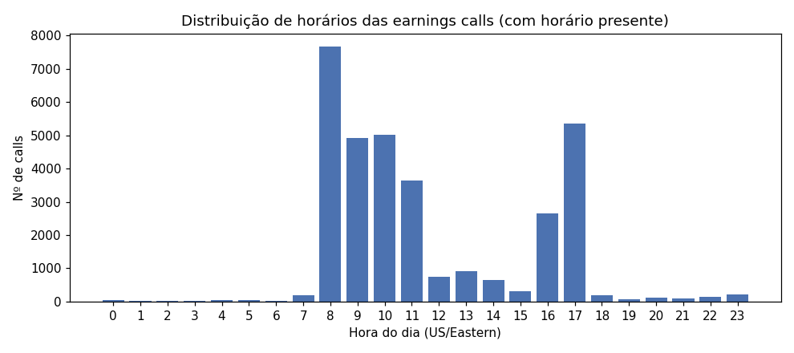

# quality_report.md — Diagnóstico da base (gerado pelo script 00)

> Gerado automaticamente. Reflete a base efetivamente baixada; reexecutar
> `make download && make diagnostics` regenera este arquivo.

## 1. Volume e qualidade
| metrica | valor |
| --- | --- |
| calls_no_dataset | 33362 |
| calls_no_universo_qualidade_ok | 5452 |
| falas_no_universo | 408248 |
| mediana_falas_por_call | 70 |
| empresas_no_universo | 116 |

## 2. Cobertura temporal (dataset completo)
| year | n_calls | n_tickers |
| --- | --- | --- |
| 2005 | 67 | 58 |
| 2006 | 358 | 113 |
| 2007 | 927 | 351 |
| 2008 | 1489 | 388 |
| 2009 | 1497 | 402 |
| 2010 | 1322 | 392 |
| 2011 | 1556 | 416 |
| 2012 | 1710 | 433 |
| 2013 | 1765 | 445 |
| 2014 | 1780 | 447 |
| 2015 | 1814 | 458 |
| 2016 | 1899 | 479 |
| 2017 | 1946 | 489 |
| 2018 | 1969 | 496 |
| 2019 | 2014 | 509 |
| 2020 | 2210 | 561 |
| 2021 | 2170 | 547 |
| 2022 | 2110 | 532 |
| 2023 | 2079 | 528 |
| 2024 | 2033 | 514 |
| 2025 | 647 | 485 |

## 3. Distribuição de horários das calls

Repartição por janela de decisão (justifica o fallback T+1, ADR-002/008):

| bucket | n_calls | share |
| --- | --- | --- |
| apos_fechamento (T+1 open) | 8783 | 0.2633 |
| pre_abertura (mesmo dia open) | 12086 | 0.3623 |
| durante_pregao (T+1 open) | 12297 | 0.3686 |
| ausente_ou_suspeito (T+1 open) | 196 | 0.0059 |

## 4. Universo por camada (ausências = candidatos ausentes do dataset/preço)
Candidatos ausentes do dataset: **34**.

| layer | n_candidates | n_in_dataset | n_in_prices |
| --- | --- | --- | --- |
| core_internet_media | 8 | 8 | 7 |
| core_it | 70 | 69 | 67 |
| delisted | 37 | 5 | 0 |
| net_discovery | 12 | 12 | 12 |
| sensitivity:ems | 3 | 2 | 2 |
| sensitivity:non_gics_tech | 7 | 7 | 7 |
| sensitivity:payments | 7 | 7 | 7 |
| sensitivity:payroll | 3 | 3 | 3 |
| sensitivity:solar_tech | 3 | 3 | 3 |

## 5. Teste de survivorship (deslistadas tech)
Nomes da lista ausentes do dataset: **32** de 37.

| ticker | present | n_calls | first_year | last_year |
| --- | --- | --- | --- | --- |
| YHOO | False | 0 | <NA> | <NA> |
| LNKD | False | 0 | <NA> | <NA> |
| SUNW | False | 0 | <NA> | <NA> |
| JAVA | False | 0 | <NA> | <NA> |
| EMC | False | 0 | <NA> | <NA> |
| BRCM | False | 0 | <NA> | <NA> |
| ALTR | True | 37 | 2005 | 2015 |
| XLNX | True | 60 | 2006 | 2021 |
| MXIM | True | 48 | 2006 | 2020 |
| LLTC | False | 0 | <NA> | <NA> |
| RHT | False | 0 | <NA> | <NA> |
| VMW | False | 0 | <NA> | <NA> |
| CTXS | False | 0 | <NA> | <NA> |
| CA | False | 0 | <NA> | <NA> |
| TWTR | True | 16 | 2018 | 2021 |
| NUAN | False | 0 | <NA> | <NA> |
| SYMC | False | 0 | <NA> | <NA> |
| MOT | False | 0 | <NA> | <NA> |
| PALM | False | 0 | <NA> | <NA> |
| RIMM | False | 0 | <NA> | <NA> |
| FSL | False | 0 | <NA> | <NA> |
| SNDK | False | 0 | <NA> | <NA> |
| NOVL | False | 0 | <NA> | <NA> |
| SEBL | False | 0 | <NA> | <NA> |
| PSFT | False | 0 | <NA> | <NA> |
| BMC | False | 0 | <NA> | <NA> |
| CPWR | False | 0 | <NA> | <NA> |
| MERQ | False | 0 | <NA> | <NA> |
| LSI | True | 33 | 2006 | 2014 |
| ATML | False | 0 | <NA> | <NA> |
| CY | False | 0 | <NA> | <NA> |
| CAVM | False | 0 | <NA> | <NA> |
| JDSU | False | 0 | <NA> | <NA> |
| TLAB | False | 0 | <NA> | <NA> |
| NVLS | False | 0 | <NA> | <NA> |
| MOLX | False | 0 | <NA> | <NA> |
| AOL | False | 0 | <NA> | <NA> |

## 6. Papéis analista×gestão
Cobertura da heurística e amostra de validação manual: ver [roles_report.md](roles_report.md) (gerado pelo script 02).
